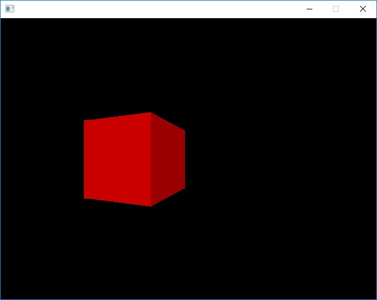

# CPURenderer

Simple one header CPU Renderer. Requires C++14 and probably not suitable for embedded devices
(due to back buffer size and would require to force disable "inline")

# Features
 - Rendering triangles
 - Input merging indexed vertices
 - Simple lighting
 - Backface culling
 - Rasterizing
 - Simple math operation
 - Uses lambdas (compatible with any UI library)
# Example result

# Todo
 - Z-Test !!!
 - Fragment stage
 - Vertex stage
 - Fix plane clipping
 - Raytracing !